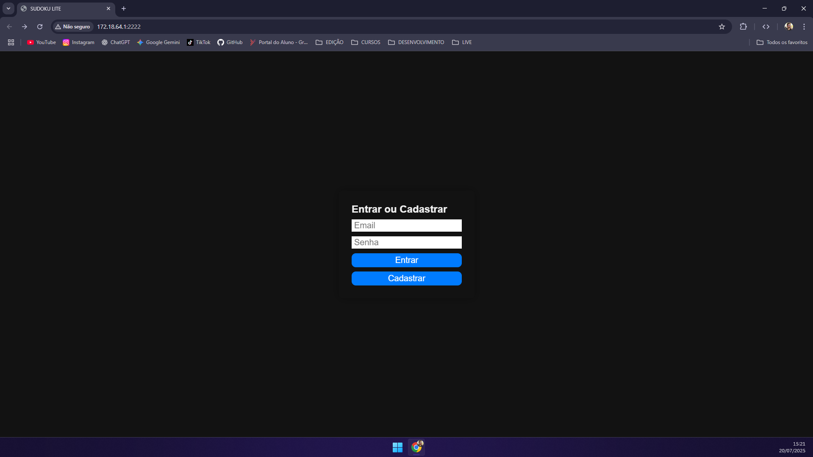
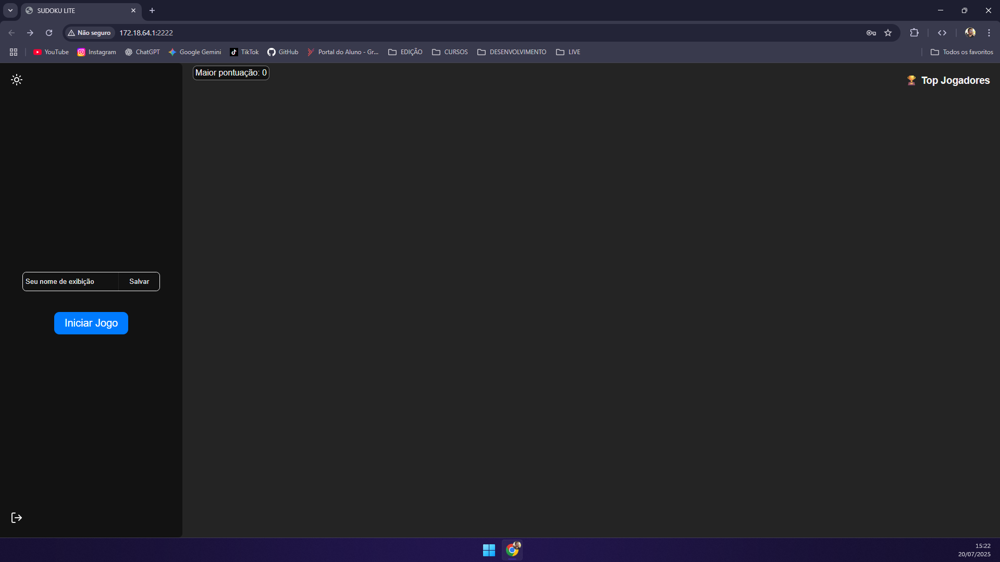
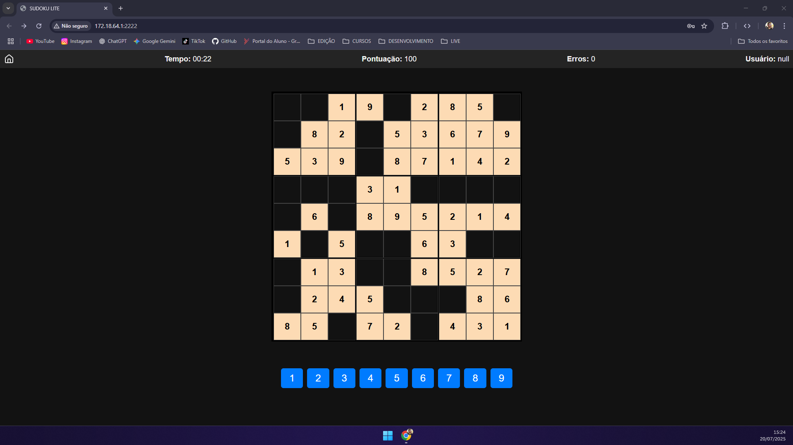

# 🧩 Sudoku Lite 🎮

Bem-vindo ao **Sudoku Lite**, um jogo de Sudoku clássico feito com HTML, CSS e JavaScript — com recursos modernos como autenticação, ranking online, tema escuro e diferentes níveis de dificuldade!

---

## 🖼️ Preview

🔐 **Tela de Login/Cadastro**  
🎛️ **Menu Inicial com Ranking**  
🎯 **Tabuleiro de Sudoku com Pontuação**






---

## 🚀 Funcionalidades

✅ Login e Cadastro via API  
✅ Pontuação dinâmica (acertos e erros influenciam)  
✅ Dificuldades: Fácil, Médio, Difícil  
✅ Ranking em tempo real dos melhores jogadores  
✅ Tema claro 🌞 / escuro 🌚  
✅ Salva seu nome e pontuação local  
✅ Totalmente responsivo 📱

---

## 🎮 Como Jogar

1. **Acesse a página** e faça login ou cadastre-se.
2. No menu, escolha seu **nome de exibição**.
3. Clique em **"Iniciar Jogo"** e selecione a dificuldade.
4. Use os botões numéricos para preencher o tabuleiro.
5. Complete o Sudoku com o menor número de erros e no menor tempo possível!

---

## 🧠 Regras do Jogo

- Cada número de 1 a 9 deve aparecer **uma vez** por linha, coluna e bloco 3x3.
- Pontuação começa em `100`.
- **+10 pontos** por acerto, com bônus se for rápido ⏱️.
- **-5 pontos** por erro.
- Número máximo de erros depende da dificuldade!

---

## 🛠️ Tecnologias Usadas

- HTML5, CSS3, JavaScript
- API REST para autenticação e ranking
- `localStorage` para persistência de sessão
- Responsivo com media queries
- Ícones com [Lucide](https://lucide.dev/)

---

## ⚙️ Instalação

1. Clone o projeto:

```bash
git clone https://github.com/euaallee/sudoku.git
cd sudoku
```

2. Abra o `index.html` em um navegador moderno.

3. Certifique-se que o backend (API) esteja rodando no mesmo IP/porta configurado no `script.js`.

## 📦 Estrutura do Projeto

```bash
📁 sudoku/
├── index.html
├── style.css
├── script.js
├── /sound
│   ├── GameWin.mp3
│   └── GameOver.mp3
└── README.md

```

## 🌐 API Esperada

- Sua API deve expor os seguintes endpoints:

| Método | Rota        | Descrição                       |
| ------ | ----------- | ------------------------------- |
| POST   | `/login`    | Login com email e senha         |
| POST   | `/register` | Cadastro de novo usuário        |
| POST   | `/player`   | Atualiza nome de exibição       |
| GET    | `/userName` | Retorna dados do usuário logado |
| GET    | `/ranking`  | Lista os top jogadores          |
| POST   | `/score`    | Envia pontuação final           |

## ✨ Créditos

Desenvolvido com 💻 e ☕ por @euaallee
Com ajuda do ChatGPT para revisão e aprimoramento.

## 📸 Galeria de Telas

| Login                         | Menu Principal              | Tabuleiro                   |
| ----------------------------- | --------------------------- | --------------------------- |
|  |  |  |

## 📄 Licença
Este projeto é de uso livre para fins educacionais e pessoais.